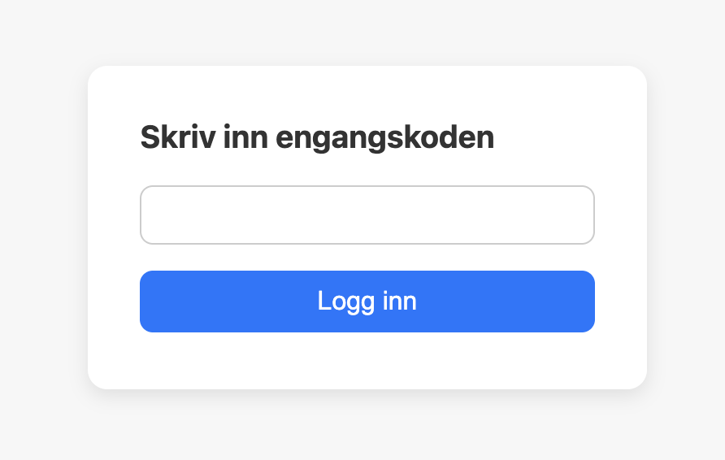

# Pythonvalg
Digitalt valgsystem der elever kan stemme på kandidater ved hjelp av engangskoder. Resultatene vises live under avstemningen.

## Hvordan det fungerer
Brukere får tildelt en engangskode som gir tilgang til å stemme en gang. Systemet sørger for at hver stemme er unik og at brukeren kun kan stemme på kandidater fra riktig klasse.

Når en stemme avgis, sendes den til mikrokontrolleren, som validerer og registrerer stemmen. Resultatene oppdateres deretter i et grafisk grensesnitt slik at man kan følge utviklingen underveis i avstemningen.

## Teknisk oversikt
- **Frontend:** HTML, CSS og JavaScript
- **Backend:** Socket basert webserver på Mbits MicroBit
- **Lagring:** Data lagres i RAM (ingen ekstern database)
- **Maskinvare:** Mbits brukes som hovedenhet for nettverk og databehandling

## Fokusområder
- Engangskoder for enkel autentisering
- Kontroll på at hver bruker kun kan stemme en gang
- Risikoanalyse og grunnleggende sikkerhet mot misbruk
- Håndtering av flere samtidige brukere via enkel webserver
- Behandling og lagring av data direkte på mikrokontroller

## Mål
Målet med prosjektet er å lage et enkelt, men fungerende digitalt stemmesystem som kan brukes i skolevalg. Løsningen er bygget for å vise hvordan et valgsystem kan fungere uten ekstern database, ved bruk av en mikrokontroller og et enkelt webgrensesnitt.
